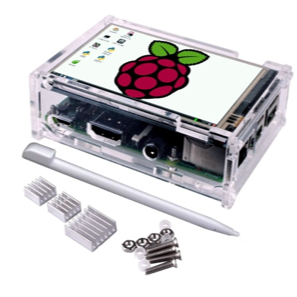

# React Dashboard PI


[](https://opensource.org/licenses/MIT) 

A dashboard to use with a Raspberry PI and it's screen between 3.5 to 7" inch

## Tech
+ React Front application
+ Python3 with Flask Server 
+ Node Package Manager 
+ File bundling with Webpack
+ ES6 and greater => ES5 Code transpiling (with Babel)
+ Styling with SASS

## Features

+ Display RATP Traffic and schedules 
+ Display weather
+ Manage Xiaomi Yeelight bulb (Autodetect, turn on and turn off)


## Requirements

* [NPM](https://www.npmjs.com/)
* [Python3](https://www.python.org/downloads/)

## Getting start


Clone this project to any folder on your local machine
```bash
git clone https://github.com/stormsa/dashboard_pi.git <FOLDER_NAME_HERE>
```
Navigate into the folder name specified
```bash
cd <FOLDER_NAME_HERE>
```

## Run It On your marchine 

+ Installing Packages

With NPM for front and pip for server
```bash 
npm install
pip3 install -r requirements.txt
```

+ Start front app

(Rendering app with webpack development server. Python server is not started yet)
(It will automatically reload if you change any of the source files)

```bash
npm run start
```

Navigate to [http://localhost:3000/](http://localhost:3000). 

+ Start server app

```bash
 npm run startwithserver
```

Navigate to [http://localhost:5000/](http://localhost:5000).

## Run it with Docker
```
docker image build -t . dashboard_pi
docker container run -d -p 5000:5000 dashboard_pi
```

## Build app only

```bash
 npm run build:production
```

## Edit autostart raspberry
```bash
 sudo cp dashboardPi_service /lib/systemd/system/dashboardPi.service
 sudo nano /lib/systemd/system/dashboardPi.service
 sudo nano /home/pi/.config/lxsession/LXDE-pi/autostart
 sudo systemctl status dashboardPi.service
```

## Contributing

1. Fork it
2. Create your feature branch (`git checkout -b my-new-feature`)
3. Commit your changes (`git commit -am 'Add some feature'`)
4. Push to the branch (`git push origin my-new-feature`)
5. Create new [Pull Request](../../pull/new/master)

## Sources

[Yeelight Api](https://yeelight.readthedocs.io/en/latest/)

[Ratp Api](https://api-ratp.pierre-grimaud.fr/v3)
